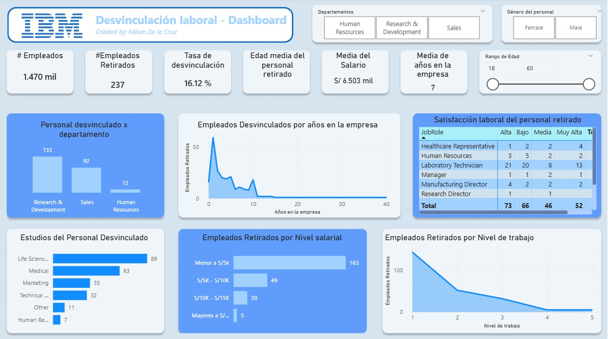
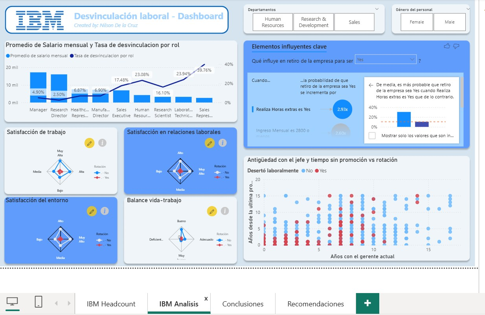

# HR Attrition Analysis — People Analytics Project

HR Attrition analysis using Power BI to identify key drivers of employee turnover and generate business recommendations.

## 📊 Project Overview

Employee attrition is a critical challenge for organizations, impacting productivity, costs, and team stability.

This project analyzes employee turnover using the IBM HR dataset to identify key drivers of attrition and generate data-driven recommendations to improve retention.

---

## 🎯 Objectives

- Identify factors influencing employee attrition  
- Analyze patterns across departments, salary levels, and tenure  
- Provide actionable business recommendations  

---

## 🛠️ Tools & Technologies

- Power BI  
- Excel  
- Data Analysis  

---

## 📈 Key Metrics

- Total Employees: 1470  
- Employees Left: 237  
- Attrition Rate: 16.12%  
- Average Age (Attrition): 34  
- Average Tenure: 7 years  

---

## 🔍 Key Insights

### 1. Overtime is a critical risk factor
Employees working overtime are **2.93x more likely** to leave the company.

### 2. Salary impacts retention significantly
Most employees who left earned **less than S/5000**, indicating compensation risk.

### 3. Departmental imbalance
The **R&D department** has the highest attrition, suggesting structural or workload issues.

### 4. Early-stage employees are more vulnerable
Lower job levels show higher turnover, indicating onboarding or growth issues.

---

## 💡 Business Recommendations

- Reduce excessive overtime through better workload distribution  
- Review compensation strategies for lower salary segments  
- Implement targeted retention strategies in high-risk departments  
- Improve onboarding and career development for junior employees  

---

## 📊 Dashboard

  
  

---

## 🚀 Project Impact

This analysis demonstrates how data can be used to:

- Improve hiring and retention decisions  
- Identify operational inefficiencies  
- Support HR strategy with data-driven insights  

---

## 📌 Next Steps

- Expand analysis using Python (EDA)  
- Apply predictive models for attrition risk  
- Integrate real-time HR dashboards  
