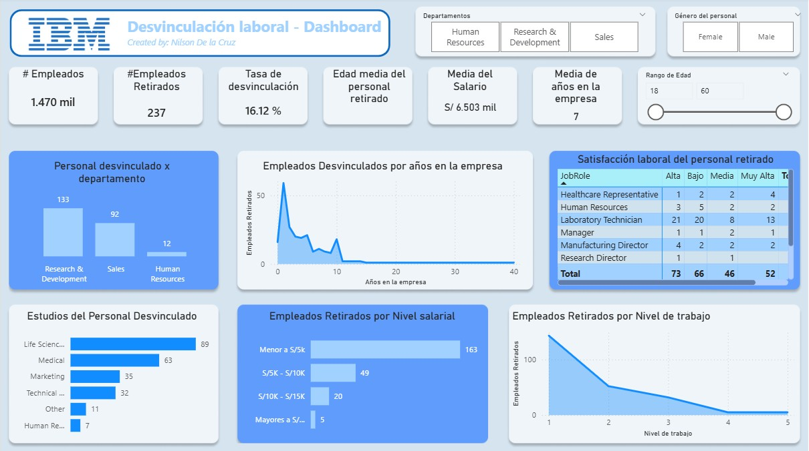
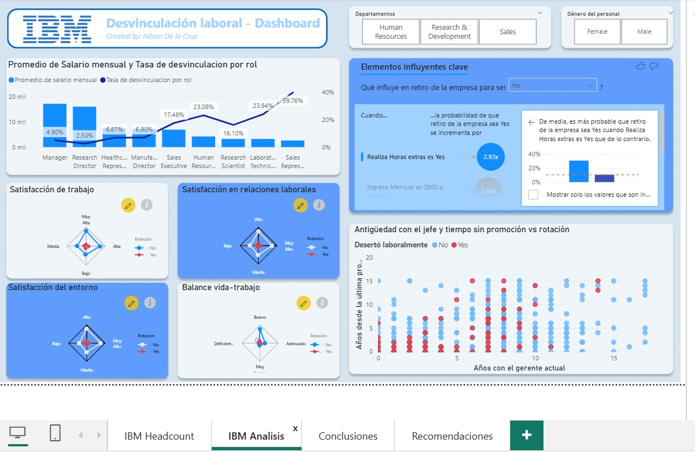

# HR Attrition Analysis — People Analytics Project


> Análisis de rotación de personal sobre el dataset IBM HR Analytics para identificar los factores que más influyen en la salida de empleados y generar recomendaciones accionables para el negocio.

---

## Contexto del problema

La rotación de personal representa uno de los costos ocultos más significativos en las organizaciones. Reemplazar a un empleado puede costar entre el 50% y 200% de su salario anual, considerando reclutamiento, onboarding y pérdida de productividad.

Este proyecto busca responder: **¿qué factores predicen mejor la salida de un empleado, y qué puede hacer RR.HH. para reducirla?**

---

## Dataset

- **Fuente:** IBM HR Analytics Employee Attrition & Performance (Kaggle)
- **Registros:** 1,470 empleados
- **Variables:** 35 atributos (edad, salario, departamento, horas extra, satisfacción laboral, años en la empresa, entre otros)
- **Variable objetivo:** `Attrition` (Yes / No)

---

## Herramientas utilizadas

| Herramienta | Uso |
|---|---|
| Power BI | Modelado de datos, DAX, dashboards interactivos |
| Power Query | Limpieza y transformación de datos |
| Excel | Exploración inicial y validación de datos |

---

## Proceso de análisis

1. **Limpieza de datos** — revisión de nulos, tipos de datos y outliers en Excel
2. **Transformación** — creación de columnas calculadas y segmentaciones en Power Query
3. **Modelado DAX** — medidas para tasa de rotación, promedios por segmento y ratios comparativos
4. **Visualización** — construcción de 2 dashboards: resumen ejecutivo y análisis de factores

---

## Resultados principales

| Métrica | Valor |
|---|---|
| Total de empleados analizados | 1,470 |
| Empleados que salieron | 237 |
| Tasa de rotación general | 16.12% |
| Edad promedio (rotación) | 34 años |
| Antigüedad promedio | 7 años |

### Hallazgos clave

**1. Las horas extra son el factor de mayor riesgo**
Los empleados con horas extra tienen **2.93x más probabilidad** de dejar la empresa. Es el predictor más fuerte del dataset.

**2. El salario bajo S/5,000 concentra la rotación**
La mayoría de empleados que salieron percibían menos de S/5,000 mensuales. Existe una relación directa entre nivel salarial y retención.

**3. El departamento de I+D concentra el mayor volumen de rotación**
Aunque no necesariamente la mayor tasa porcentual, R&D acumula la mayor cantidad de salidas absolutas, lo que impacta directamente la continuidad operativa.

**4. Los niveles de entrada son los más vulnerables**
Los empleados en Job Level 1 muestran la tasa de rotación más alta, sugiriendo problemas en onboarding, expectativas o desarrollo de carrera temprano.

---

## Dashboards

### Vista 1 — Resumen ejecutivo


### Vista 2 — Análisis por factores


---

## Recomendaciones para el negocio

- **Política de horas extra:** establecer límites y monitorear empleados con sobreexposición sostenida
- **Revisión de bandas salariales:** priorizar ajustes en el rango crítico inferior (< S/5,000)
- **Estrategia de retención focalizada en R&D:** entrevistas de permanencia, planes de desarrollo y carga de trabajo balanceada
- **Programa de onboarding reforzado:** acompañamiento estructurado para empleados en los primeros 12 meses y Job Level 1

---

## Estructura del repositorio

```
hr-attrition-analysis/
├── data/
│   └── HR_Analytics_IBM.csv       # Dataset original
├── dashboard/
│   └── hr_attrition.pbix          # Archivo Power BI
├── images/
│   ├── dashboard1.jpg             # Captura vista 1
│   └── dashboard2.jpg             # Captura vista 2
└── README.md
```

---

## Autor

**Nilson De la Cruz**
Data Analyst | People Analytics | Data Science & AI Engineering Student

[](https://www.linkedin.com/in/nilson-delacruz/)
[](mailto:nilsondelacruz01@gmail.com)
